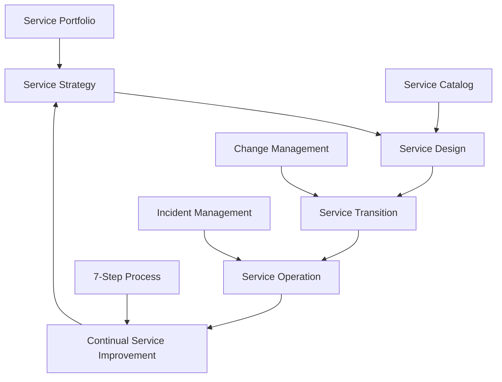
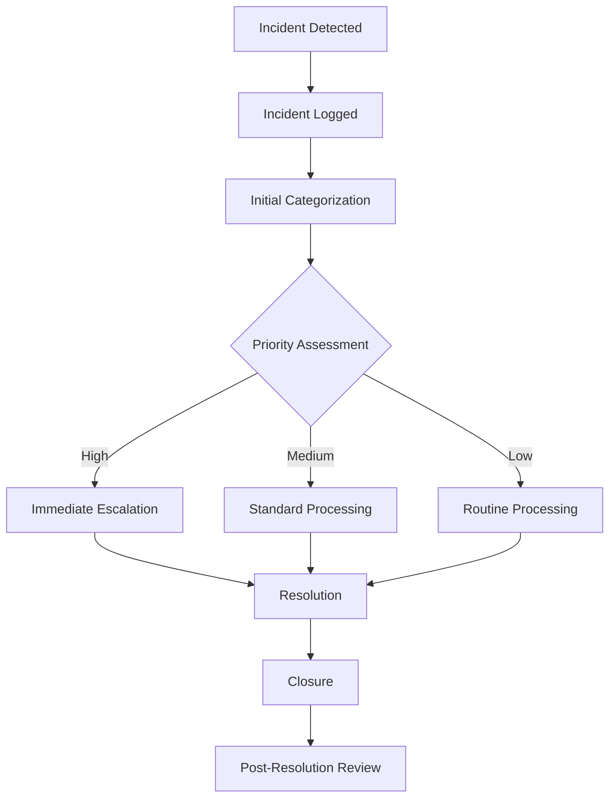
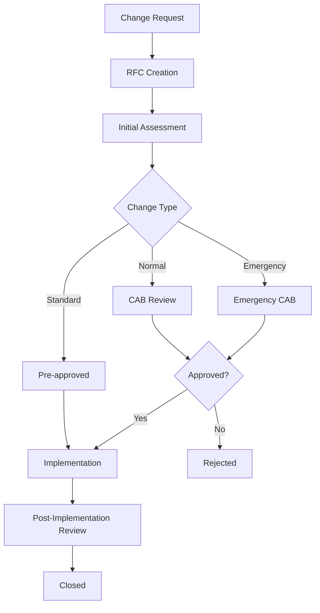

# ITIL Service Management Framework - Personal Detailed Notes

## Project Overview
This is a comprehensive IT Service Management (ITSM) framework implementation that aligns with ITIL (Information Technology Infrastructure Library) standards. The project demonstrates practical application of ITIL processes through a Python-based system for managing IT assets, configuration items, and service dependencies.

## ITIL Alignment & Core Processes

### 1. Configuration Management Database (CMDB)
**ITIL Process**: Configuration Management
- **Purpose**: Maintains accurate information about Configuration Items (CIs) and their relationships
- **Implementation**: 
  - `ConfigurationItem` class tracks name, type, status, and relationships
  - Supports dependency mapping between CIs
  - Example CIs: Web Server, Database, Application Server, Firewall
- **Key Features**:
  - Relationship tracking (e.g., Database depends on Web Server)
  - Status management (Active, Maintenance, Operational)
  - Type categorization (Server, DB, Network)

### 2. Asset Management
**ITIL Process**: Asset Management
- **Purpose**: Manages the complete lifecycle of IT assets
- **Implementation**:
  - `Asset` class with unique ID, name, owner, and lifecycle status
  - Tracks asset ownership and current state
- **Asset Types Demonstrated**:
  - Hardware: Laptops, Servers, Routers, Switches, Storage Arrays
  - Network: Firewall Appliances
- **Lifecycle States**: In Use, Operational, Active, Maintenance

### 3. Service Mapping
**ITIL Process**: Service Design & Service Transition
- **Purpose**: Maps business services to underlying IT assets and CIs
- **Implementation**:
  - `map_service_to_assets()` function creates service-to-asset relationships
  - Enables impact analysis and change management
- **Service Examples**:
  - Website Hosting (Server + Router + Switch)
  - Database Service (Server + Storage)
  - Internal Application (Server + Laptop)
  - Network Security (Firewall Appliance)

### 4. Monitoring & Reporting
**ITIL Process**: Service Operation & Continual Service Improvement
- **Purpose**: Proactive monitoring and status reporting
- **Implementation**:
  - Automated status checks with simulated monitoring
  - Status levels: OK, Warning, Critical
  - Comprehensive reporting across all assets

## Technical Architecture

### Module Structure
```
IT_Service_Management/
├── cmdb/           # Configuration Management Database
├── assets/         # Asset Inventory Management  
├── service_mapping/ # Service-to-Asset Mapping
├── monitoring/     # Status Monitoring & Reporting
└── main.py        # Integration & Demo
```

### Key Classes & Functions

#### ConfigurationItem (CMDB)
```python
class ConfigurationItem:
    - name: str
    - type: str  
    - status: str
    - relationships: list
    - add_relationship(other_item)
```

#### Asset (Asset Management)
```python
class Asset:
    - asset_id: str
    - name: str
    - owner: str
    - lifecycle_status: str
```

#### Service Mapping
```python
def map_service_to_assets(service_name, asset_list):
    # Returns service-to-asset mapping dictionary
```

#### Monitoring
```python
def check_asset_status(asset):
    # Simulates status monitoring
def generate_report(assets):
    # Generates comprehensive status report
```

## ITIL Process Integration

### Service Strategy
- **Service Portfolio Management**: Clear service definitions and asset dependencies
- **Financial Management**: Asset ownership tracking enables cost allocation

### Service Design
- **Service Level Management**: Service mapping enables SLA monitoring
- **Capacity Management**: Asset tracking supports capacity planning
- **Availability Management**: Status monitoring ensures service availability

### Service Transition
- **Change Management**: CMDB relationships support impact analysis
- **Release Management**: Asset tracking supports deployment planning
- **Service Asset & Configuration Management**: Core CMDB functionality

### Service Operation
- **Incident Management**: Status monitoring enables rapid incident detection
- **Problem Management**: Asset relationships help identify root causes
- **Event Management**: Automated monitoring provides event detection

### Continual Service Improvement
- **Service Measurement**: Reporting provides performance metrics
- **Service Reporting**: Automated reports support decision making

## Practical Applications

### 1. Change Impact Analysis
When planning changes to the Web Server:
- Identify dependent services (Website Hosting)
- Assess impact on related CIs (Database, Firewall)
- Plan rollback procedures

### 2. Incident Response
When Laptop shows "Critical" status:
- Identify affected services (Internal Application)
- Notify asset owner (Alice)
- Escalate to appropriate support team

### 3. Service Dependencies
Understanding that Database Service requires:
- Server (A004) - Active
- Storage Array (A005) - Active
- Both must be operational for service availability

### 4. Asset Lifecycle Management
Tracking assets from:
- Procurement (new asset creation)
- Deployment (status: In Use/Operational)
- Maintenance (status: Maintenance)
- Retirement (status: Retired)

## ITIL Best Practices Demonstrated

### 1. Single Source of Truth
- CMDB maintains authoritative CI information
- Asset inventory provides complete asset visibility

### 2. Relationship Management
- Clear CI dependencies (Database → Web Server)
- Service-to-asset mapping for impact analysis

### 3. Status Management
- Consistent status tracking across CIs and assets
- Clear lifecycle state definitions

### 4. Automated Monitoring
- Proactive status checking
- Standardized reporting format

### 5. Service-Centric View
- Business services mapped to technical components
- Clear service boundaries and dependencies

## Learning Outcomes

### Technical Skills
- Python object-oriented programming
- Modular software architecture
- Database design principles
- API design patterns

### ITIL Knowledge
- Configuration Management processes
- Asset Management lifecycle
- Service mapping techniques
- Monitoring and reporting strategies

### Practical Experience
- Implementing ITIL processes in code
- Building scalable ITSM solutions
- Understanding service dependencies
- Creating automated monitoring systems

## Additional ITIL Processes & Frameworks

### Service Strategy Processes

#### Service Portfolio Management
- **Current Implementation**: Basic service mapping in `service_mapping/`
- **ITIL Definition**: Manages the complete set of services throughout their lifecycle
- **Enhancement Opportunities**:
  - Service pipeline management (retired, current, future services)
  - Service catalog with business value assessment
  - Service retirement planning and migration strategies

#### Financial Management for IT Services
- **Current Implementation**: Asset ownership tracking enables basic cost allocation
- **ITIL Definition**: Manages IT service costs and budgets
- **Enhancement Opportunities**:
  - Cost modeling for services (hardware, software, labor)
  - Budget planning and variance analysis
  - Chargeback/showback mechanisms
  - ROI calculations for service investments

#### Demand Management
- **Current Implementation**: Not directly implemented
- **ITIL Definition**: Understands and influences customer demand for services
- **Enhancement Opportunities**:
  - Capacity planning based on historical data
  - Peak usage pattern analysis
  - Resource scaling recommendations

### Service Design Processes

#### Service Level Management
- **Current Implementation**: Basic monitoring with OK/Warning/Critical status
- **ITIL Definition**: Negotiates, agrees, and documents service level targets
- **Enhancement Opportunities**:
  - SLA definition and tracking (availability, response time, throughput)
  - Service level reporting and dashboards
  - Penalty calculations and breach notifications
  - Customer satisfaction surveys

#### Capacity Management
- **Current Implementation**: Asset tracking supports basic capacity awareness
- **ITIL Definition**: Ensures IT capacity meets current and future business needs
- **Enhancement Opportunities**:
  - Resource utilization monitoring
  - Capacity forecasting and planning
  - Performance bottleneck identification
  - Scaling recommendations

#### Availability Management
- **Current Implementation**: Status monitoring provides availability insights
- **ITIL Definition**: Ensures IT services meet agreed availability targets
- **Enhancement Opportunities**:
  - MTTR (Mean Time To Repair) calculations
  - MTBF (Mean Time Between Failures) tracking
  - Availability percentage calculations
  - Planned vs unplanned downtime analysis

#### IT Service Continuity Management
- **Current Implementation**: Not implemented
- **ITIL Definition**: Maintains IT service continuity in case of disasters
- **Enhancement Opportunities**:
  - Business impact analysis (BIA)
  - Recovery time objective (RTO) and recovery point objective (RPO)
  - Disaster recovery planning and testing
  - Backup and restore procedures

#### Information Security Management
- **Current Implementation**: Basic firewall asset tracking
- **ITIL Definition**: Manages IT service security
- **Enhancement Opportunities**:
  - Security vulnerability tracking
  - Access control management
  - Security incident response
  - Compliance monitoring

#### Supplier Management
- **Current Implementation**: Not implemented
- **ITIL Definition**: Manages suppliers and their performance
- **Enhancement Opportunities**:
  - Vendor performance tracking
  - Contract management
  - Supplier risk assessment
  - SLA monitoring for external services

### Service Transition Processes

#### Change Management
- **Current Implementation**: CMDB relationships support impact analysis
- **ITIL Definition**: Controls changes to IT services and infrastructure
- **Enhancement Opportunities**:
  - Change request workflow (RFC creation, approval, implementation)
  - Change advisory board (CAB) management
  - Change scheduling and coordination
  - Change success/failure tracking

#### Release and Deployment Management
- **Current Implementation**: Asset tracking supports deployment planning
- **ITIL Definition**: Plans, schedules, and controls releases
- **Enhancement Opportunities**:
  - Release planning and scheduling
  - Deployment pipeline management
  - Rollback procedures
  - Release testing and validation

#### Service Validation and Testing
- **Current Implementation**: Not implemented
- **ITIL Definition**: Validates that services meet requirements
- **Enhancement Opportunities**:
  - Test case management
  - Test execution tracking
  - Quality gates and criteria
  - Test environment management

#### Knowledge Management
- **Current Implementation**: Not implemented
- **ITIL Definition**: Manages knowledge and information
- **Enhancement Opportunities**:
  - Knowledge base creation and maintenance
  - Document management
  - Search and retrieval capabilities
  - Knowledge sharing workflows

### Service Operation Processes

#### Incident Management
- **Current Implementation**: Status monitoring enables incident detection
- **ITIL Definition**: Restores normal service operation quickly
- **Enhancement Opportunities**:
  - Incident ticket creation and tracking
  - Priority and impact classification
  - Escalation procedures
  - Incident resolution workflows

#### Problem Management
- **Current Implementation**: Asset relationships help identify root causes
- **ITIL Definition**: Prevents incidents and reduces their impact
- **Enhancement Opportunities**:
  - Problem ticket management
  - Root cause analysis tools
  - Known error database (KEDB)
  - Workaround documentation

#### Event Management
- **Current Implementation**: Basic status monitoring
- **ITIL Definition**: Monitors all events throughout the IT infrastructure
- **Enhancement Opportunities**:
  - Event correlation and filtering
  - Automated response to events
  - Event escalation procedures
  - Event logging and archiving

#### Request Fulfillment
- **Current Implementation**: Not implemented
- **ITIL Definition**: Handles service requests from users
- **Enhancement Opportunities**:
  - Service request catalog
  - Approval workflows
  - Fulfillment tracking
  - Self-service portal

#### Access Management
- **Current Implementation**: Not implemented
- **ITIL Definition**: Grants users access to services
- **Enhancement Opportunities**:
  - User access request management
  - Access provisioning and deprovisioning
  - Access review and certification
  - Privileged access management

### Continual Service Improvement (CSI)

#### The 7-Step Improvement Process
1. **Define what you should measure** - Service metrics and KPIs
2. **Define what you can measure** - Available data sources
3. **Gather the data** - Data collection mechanisms
4. **Process the data** - Analysis and reporting
5. **Analyze the data** - Trend analysis and insights
6. **Present and use the information** - Dashboards and reports
7. **Implement corrective action** - Improvement initiatives

#### CSI Register
- **Current Implementation**: Basic monitoring reports
- **Enhancement Opportunities**:
  - Improvement opportunity tracking
  - Cost-benefit analysis
  - Implementation planning
  - Success measurement

## ITIL 4 Framework Integration

### Service Value System (SVS)
- **Guiding Principles**: Focus on value, start where you are, progress iteratively
- **Governance**: Policies, procedures, and decision-making frameworks
- **Service Value Chain**: Plan, Improve, Engage, Design & Transition, Obtain/Build, Deliver & Support
- **Practices**: 34 management practices (including the 26 from ITIL v3)

### Service Value Chain Activities

#### Plan
- **Current Implementation**: Service mapping and asset planning
- **Enhancement**: Strategic planning, portfolio management, architecture planning

#### Improve
- **Current Implementation**: Monitoring and reporting
- **Enhancement**: Continuous improvement processes, innovation management

#### Engage
- **Current Implementation**: Asset ownership tracking
- **Enhancement**: Stakeholder management, relationship management

#### Design & Transition
- **Current Implementation**: CMDB and service mapping
- **Enhancement**: Service design, change management, release management

#### Obtain/Build
- **Current Implementation**: Asset management
- **Enhancement**: Procurement, development, knowledge management

#### Deliver & Support
- **Current Implementation**: Monitoring and asset status
- **Enhancement**: Service desk, incident management, request fulfillment

## ITIL Maturity Assessment

### Current Maturity Level: 2-3 (Managed to Defined)

#### Strengths:
- Basic CMDB implementation
- Asset lifecycle tracking
- Service mapping capabilities
- Automated monitoring

#### Areas for Improvement:
- Process formalization
- Integration between processes
- Metrics and KPIs
- Governance and control

### Target Maturity Level: 4-5 (Quantitatively Managed to Optimizing)

#### Required Enhancements:
- Advanced analytics and reporting
- Process automation and orchestration
- Integration with external systems
- Continuous improvement culture

## Future Enhancements

### ITIL Process Extensions
- **Incident Management**: Ticket creation and tracking
- **Change Management**: Change request workflow
- **Problem Management**: Root cause analysis tools
- **Service Level Management**: SLA monitoring and reporting
- **Knowledge Management**: Knowledge base and documentation
- **Request Fulfillment**: Service request catalog and workflows

### Technical Improvements
- Database persistence (SQLite/PostgreSQL)
- Web-based dashboard
- REST API for external integrations
- Real-time monitoring with alerts
- Automated discovery tools
- Machine learning for predictive analytics

### Advanced Features
- Service catalog management
- Workflow automation and orchestration
- Advanced reporting and analytics
- Integration with external monitoring tools
- Mobile applications for field support
- Chatbot integration for self-service

## ITIL Process Flow Diagrams

### Service Lifecycle Overview


### Incident Management Process Flow


### Change Management Process Flow


## ITIL Key Performance Indicators (KPIs)

### Service Level Management KPIs
| Metric | Description | Target | Current Implementation |
|--------|-------------|---------|----------------------|
| **Service Availability** | Percentage of time service is available | 99.9% | Basic status monitoring |
| **Mean Time To Repair (MTTR)** | Average time to restore service | < 4 hours | Not implemented |
| **Mean Time Between Failures (MTBF)** | Average time between service failures | > 720 hours | Not implemented |
| **Service Level Agreement (SLA) Compliance** | Percentage of SLAs met | 95% | Not implemented |

### Incident Management KPIs
| Metric | Description | Target | Current Implementation |
|--------|-------------|---------|----------------------|
| **First Call Resolution Rate** | Incidents resolved on first contact | 70% | Not implemented |
| **Average Resolution Time** | Time from logging to resolution | < 8 hours | Not implemented |
| **Incident Backlog** | Number of open incidents | < 50 | Not implemented |
| **Escalation Rate** | Percentage of incidents escalated | < 20% | Not implemented |

### Change Management KPIs
| Metric | Description | Target | Current Implementation |
|--------|-------------|---------|----------------------|
| **Change Success Rate** | Percentage of successful changes | 95% | Not implemented |
| **Emergency Change Rate** | Percentage of emergency changes | < 5% | Not implemented |
| **Change Lead Time** | Time from request to implementation | < 5 days | Not implemented |
| **Change Backlog** | Number of pending changes | < 100 | Not implemented |

## ITIL Roles and Responsibilities

### Service Strategy Roles
| Role | Responsibilities | Current Implementation |
|------|------------------|----------------------|
| **Service Portfolio Manager** | Manages service portfolio, strategic planning | Not implemented |
| **Financial Manager** | IT financial planning, budgeting, cost allocation | Basic asset ownership tracking |
| **Business Relationship Manager** | Customer relationship management | Not implemented |

### Service Design Roles
| Role | Responsibilities | Current Implementation |
|------|------------------|----------------------|
| **Service Level Manager** | SLA negotiation, monitoring, reporting | Basic monitoring |
| **Capacity Manager** | Capacity planning, performance monitoring | Asset tracking supports awareness |
| **Availability Manager** | Availability planning, monitoring | Status monitoring provides insights |
| **IT Security Manager** | Security policy, incident response | Basic firewall tracking |
| **Supplier Manager** | Vendor management, contract oversight | Not implemented |

### Service Transition Roles
| Role | Responsibilities | Current Implementation |
|------|------------------|----------------------|
| **Change Manager** | Change control, CAB management | CMDB relationships support impact analysis |
| **Release Manager** | Release planning, deployment | Asset tracking supports planning |
| **Service Asset & Configuration Manager** | CMDB management, CI control | ConfigurationItem class |
| **Knowledge Manager** | Knowledge base, documentation | Not implemented |

### Service Operation Roles
| Role | Responsibilities | Current Implementation |
|------|------------------|----------------------|
| **Service Desk Manager** | Service desk operations | Not implemented |
| **Incident Manager** | Incident coordination, escalation | Status monitoring enables detection |
| **Problem Manager** | Root cause analysis, prevention | Asset relationships help identification |
| **Event Manager** | Event monitoring, correlation | Basic status monitoring |

## ITIL Maturity Model

### Level 1: Initial (Ad-hoc)
- **Characteristics**: Processes are unpredictable, poorly controlled, and reactive
- **Current Status**: Not applicable - project has some structure

### Level 2: Managed (Repeatable)
- **Characteristics**: Basic processes established, some consistency
- **Current Status**: **PARTIALLY ACHIEVED**
  - ✅ Basic CMDB structure
  - ✅ Asset tracking
  - ✅ Service mapping
  - ❌ Process documentation
  - ❌ Standardized procedures

### Level 3: Defined (Standardized)
- **Characteristics**: Processes documented, standardized, and integrated
- **Current Status**: **PARTIALLY ACHIEVED**
  - ✅ Modular architecture
  - ✅ Clear separation of concerns
  - ❌ Process documentation
  - ❌ Integration between processes
  - ❌ Standardized workflows

### Level 4: Quantitatively Managed (Measured)
- **Characteristics**: Processes measured, controlled, and predictable
- **Current Status**: **NOT ACHIEVED**
  - ❌ Metrics collection
  - ❌ Performance measurement
  - ❌ Statistical process control
  - ❌ Predictive capabilities

### Level 5: Optimizing (Continuously Improving)
- **Characteristics**: Continuous improvement, innovation, optimization
- **Current Status**: **NOT ACHIEVED**
  - ❌ Continuous improvement culture
  - ❌ Innovation management
  - ❌ Process optimization
  - ❌ Advanced analytics

## ITIL Implementation Roadmap

### Phase 1: Foundation (Months 1-3)
- [ ] **Process Documentation**
  - Document current processes
  - Create process flow diagrams
  - Define roles and responsibilities
- [ ] **Basic Metrics**
  - Implement basic KPI collection
  - Create simple dashboards
  - Establish baseline measurements

### Phase 2: Enhancement (Months 4-6)
- [ ] **Process Integration**
  - Connect CMDB with incident management
  - Integrate asset management with change management
  - Link service mapping with availability management
- [ ] **Workflow Automation**
  - Implement incident ticket creation
  - Create change request workflows
  - Add approval processes

### Phase 3: Optimization (Months 7-9)
- [ ] **Advanced Analytics**
  - Implement trend analysis
  - Add predictive capabilities
  - Create advanced reporting
- [ ] **Service Level Management**
  - Define and track SLAs
  - Implement availability monitoring
  - Create service level reports

### Phase 4: Innovation (Months 10-12)
- [ ] **Continuous Improvement**
  - Implement CSI processes
  - Add innovation management
  - Create feedback loops
- [ ] **Advanced Features**
  - Machine learning integration
  - Predictive analytics
  - Automated remediation

## ITIL Best Practices Checklist

### Configuration Management
- [ ] **Single Source of Truth**: CMDB contains authoritative CI information
- [ ] **Relationship Management**: CIs and their dependencies are mapped
- [ ] **Change Control**: All changes go through proper approval
- [ ] **Audit Trail**: All changes are logged and traceable
- [ ] **Regular Reconciliation**: CMDB accuracy is verified regularly

### Asset Management
- [ ] **Lifecycle Tracking**: Assets tracked from procurement to disposal
- [ ] **Ownership Management**: Clear asset ownership and responsibility
- [ ] **Financial Tracking**: Asset costs and depreciation tracked
- [ ] **Compliance**: Assets meet security and compliance requirements
- [ ] **Regular Audits**: Physical and logical asset audits conducted

### Service Management
- [ ] **Service Catalog**: Clear service definitions and offerings
- [ ] **Service Level Agreements**: SLAs defined and monitored
- [ ] **Service Dependencies**: Service relationships mapped
- [ ] **Service Performance**: Service metrics collected and reported
- [ ] **Customer Satisfaction**: Regular customer feedback collection

### Incident Management
- [ ] **Rapid Response**: Incidents detected and logged quickly
- [ ] **Proper Categorization**: Incidents classified by impact and urgency
- [ ] **Escalation Procedures**: Clear escalation paths defined
- [ ] **Resolution Tracking**: Incidents tracked to resolution
- [ ] **Post-Incident Review**: Lessons learned captured

### Change Management
- [ ] **Change Control**: All changes go through approval process
- [ ] **Impact Assessment**: Changes assessed for risk and impact
- [ ] **Testing**: Changes tested before implementation
- [ ] **Rollback Plans**: Rollback procedures defined
- [ ] **Change Communication**: Stakeholders informed of changes

## ITIL Tools and Technologies

### CMDB Tools
| Tool | Purpose | Current Implementation |
|------|---------|----------------------|
| **ServiceNow** | Enterprise CMDB platform | Custom Python classes |
| **BMC Remedy** | ITSM suite with CMDB | Not implemented |
| **Cherwell** | IT service management platform | Not implemented |
| **Custom Solution** | Python-based CMDB | ✅ Implemented |

### Monitoring Tools
| Tool | Purpose | Current Implementation |
|------|---------|----------------------|
| **Nagios** | Infrastructure monitoring | Basic status simulation |
| **Zabbix** | Network and application monitoring | Not implemented |
| **SolarWinds** | IT infrastructure monitoring | Not implemented |
| **Prometheus** | Metrics collection and alerting | Not implemented |

### Service Desk Tools
| Tool | Purpose | Current Implementation |
|------|---------|----------------------|
| **Jira Service Management** | IT service desk | Not implemented |
| **Freshservice** | Modern IT service management | Not implemented |
| **ManageEngine ServiceDesk Plus** | ITIL-aligned service desk | Not implemented |
| **Custom Solution** | Python-based service desk | Not implemented |

## ITIL Compliance and Certification

### ITIL Foundation Certification
- **Prerequisites**: None
- **Content**: ITIL concepts, processes, and terminology
- **Duration**: 2-3 days
- **Exam**: 40 multiple choice questions, 65% pass rate
- **Validity**: Lifetime

### ITIL Intermediate Certifications
- **Service Lifecycle Modules**:
  - Service Strategy
  - Service Design
  - Service Transition
  - Service Operation
  - Continual Service Improvement
- **Service Capability Modules**:
  - Operational Support and Analysis
  - Planning, Protection and Optimization
  - Release, Control and Validation
  - Service Offerings and Agreements

### ITIL Expert Certification
- **Prerequisites**: ITIL Foundation + 17 credits from Intermediate modules
- **Content**: Advanced ITIL knowledge and application
- **Duration**: Varies based on modules completed
- **Exam**: Case study-based
- **Validity**: Lifetime

### ITIL Master Certification
- **Prerequisites**: ITIL Expert + 5+ years experience
- **Content**: Real-world ITIL application and leadership
- **Duration**: Portfolio submission and interview
- **Assessment**: Portfolio review and oral examination
- **Validity**: Lifetime

## Conclusion

This project demonstrates a solid foundation for implementing ITIL-based IT Service Management processes. It provides practical experience with core ITSM concepts while maintaining clean, maintainable code architecture. The modular design allows for easy extension and integration with larger enterprise systems.

The framework successfully bridges the gap between ITIL theory and practical implementation, providing a working example of how IT service management processes can be automated and managed through software systems.

### Key Achievements
- ✅ **CMDB Implementation**: Basic configuration management database
- ✅ **Asset Management**: IT asset lifecycle tracking
- ✅ **Service Mapping**: Service-to-asset relationship mapping
- ✅ **Monitoring Framework**: Automated status monitoring and reporting
- ✅ **Modular Architecture**: Extensible and maintainable code structure

### Next Steps
1. **Process Documentation**: Document all implemented processes
2. **Metrics Implementation**: Add KPI collection and reporting
3. **Workflow Automation**: Implement incident and change management workflows
4. **Integration**: Connect processes and add data persistence
5. **Advanced Features**: Add analytics, reporting, and continuous improvement capabilities

This comprehensive ITIL framework provides a strong foundation for understanding and implementing IT service management best practices in real-world scenarios.
