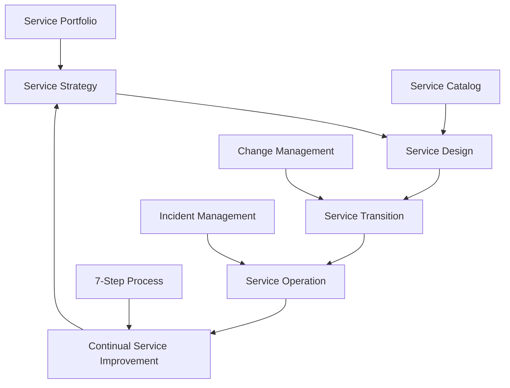
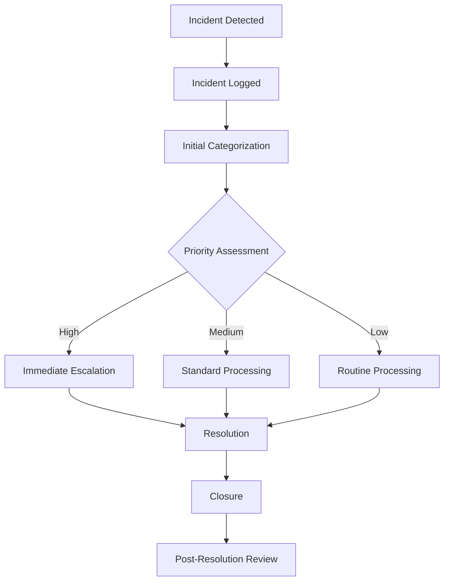
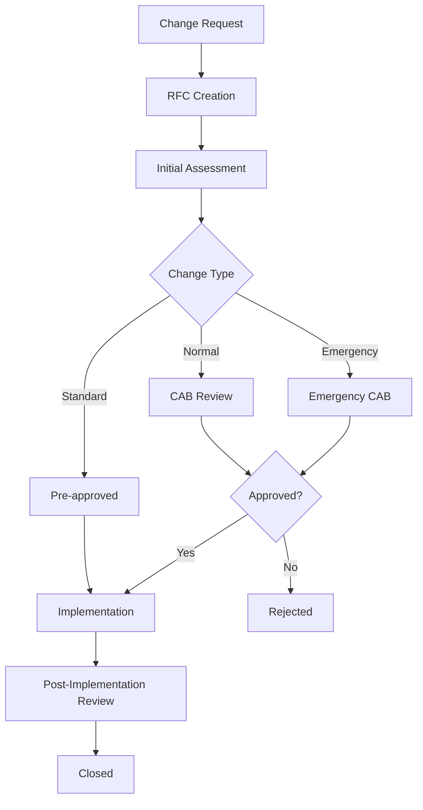

# 🏢 IT Service Management Framework

[](https://python.org)
[](https://www.axelos.com/best-practice-solutions/itil)
[](LICENSE)
[](https://github.com/yourusername/IT_Service_Management)

A comprehensive **IT Service Management (ITSM)** framework implementation that aligns with **ITIL v4** standards. This project demonstrates practical application of ITIL processes through a Python-based system for managing IT assets, configuration items, and service dependencies.

## 📋 Table of Contents

- [Features](#-features)
- [ITIL Processes Implemented](#-itil-processes-implemented)
- [Architecture](#-architecture)
- [Quick Start](#-quick-start)
- [Usage Examples](#-usage-examples)
- [ITIL Process Flow](#-itil-process-flow)
- [Maturity Assessment](#-maturity-assessment)
- [Future Enhancements](#-future-enhancements)
- [Contributing](#-contributing)

## 🚀 Features

### Core ITSM Capabilities
- **🔧 Configuration Management Database (CMDB)** - Track configuration items and relationships
- **📦 Asset Management** - Complete IT asset lifecycle tracking
- **🗺️ Service Mapping** - Map business services to technical assets
- **📊 Monitoring & Reporting** - Automated status monitoring and reporting
- **🔗 Dependency Management** - Track service and asset dependencies

### ITIL Alignment
- ✅ **Configuration Management** - CMDB with CI relationships
- ✅ **Asset Management** - Lifecycle tracking from procurement to disposal
- ✅ **Service Design** - Service-to-asset mapping
- ✅ **Service Operation** - Automated monitoring and status reporting
- ✅ **Continual Service Improvement** - Performance measurement and reporting

## 🏗️ ITIL Processes Implemented

| ITIL Process | Implementation Status | Key Features |
|--------------|----------------------|--------------|
| **Configuration Management** | ✅ Implemented | CMDB, CI relationships, dependency mapping |
| **Asset Management** | ✅ Implemented | Lifecycle tracking, ownership management |
| **Service Mapping** | ✅ Implemented | Business service to asset mapping |
| **Monitoring & Reporting** | ✅ Implemented | Automated status checks, comprehensive reports |
| **Incident Management** | 🔄 Partial | Status monitoring enables incident detection |
| **Change Management** | 🔄 Partial | CMDB relationships support impact analysis |
| **Problem Management** | 🔄 Partial | Asset relationships help root cause analysis |

## 🏛️ Architecture

```
IT_Service_Management/
├── 📁 cmdb/              # Configuration Management Database
│   └── ConfigurationItem class with relationships
├── 📁 assets/            # Asset Inventory Management  
│   └── Asset class with lifecycle tracking
├── 📁 service_mapping/   # Service-to-Asset Mapping
│   └── Service mapping functions
├── 📁 monitoring/        # Status Monitoring & Reporting
│   └── Automated monitoring and reporting
└── 📄 main.py           # Integration & Demo
```


## 🔄 ITIL Process Flow

### Service Lifecycle Overview


### Incident Management Process


### Change Management Process


## 📊 Maturity Assessment

### Current Maturity Level: **2-3** (Managed to Defined)

#### ✅ Achieved Capabilities
- Basic CMDB implementation with CI relationships
- Asset lifecycle tracking and ownership management
- Service mapping capabilities for impact analysis
- Automated monitoring and status reporting
- Modular, extensible architecture

#### 🔄 Areas for Improvement
- Process formalization and documentation
- Integration between ITSM processes
- Metrics collection and KPI tracking
- Governance and control mechanisms

### Target Maturity Level: **4-5** (Quantitatively Managed to Optimizing)

## 🎯 Future Enhancements

### Phase 1: Foundation (Months 1-3)
- [ ] **Process Documentation** - Document all ITSM processes
- [ ] **Basic Metrics** - Implement KPI collection and dashboards
- [ ] **Data Persistence** - Add database support (SQLite/PostgreSQL)

### Phase 2: Enhancement (Months 4-6)
- [ ] **Process Integration** - Connect CMDB with incident management
- [ ] **Workflow Automation** - Implement ticket creation and approval workflows
- [ ] **Web Interface** - Create web-based dashboard

### Phase 3: Optimization (Months 7-9)
- [ ] **Advanced Analytics** - Add trend analysis and predictive capabilities
- [ ] **Service Level Management** - Implement SLA monitoring and reporting
- [ ] **API Integration** - REST API for external system integration

### Phase 4: Innovation (Months 10-12)
- [ ] **Continuous Improvement** - Implement CSI processes
- [ ] **Machine Learning** - Add predictive analytics and automated remediation
- [ ] **Advanced Features** - Mobile apps, chatbot integration

## 📈 Key Performance Indicators (KPIs)

| Metric | Description | Target | Status |
|--------|-------------|---------|--------|
| **Service Availability** | Percentage of time service is available | 99.9% | 🔄 In Development |
| **MTTR** | Mean Time To Repair | < 4 hours | 🔄 In Development |
| **Change Success Rate** | Percentage of successful changes | 95% | 🔄 In Development |
| **Asset Accuracy** | CMDB data accuracy | 98% | ✅ Implemented |

## 🤝 Contributing

We welcome contributions to improve this ITSM framework! Here's how you can help:

### How to Contribute
1. **Fork** the repository
2. **Create** a feature branch (`git checkout -b feature/amazing-feature`)
3. **Commit** your changes (`git commit -m 'Add amazing feature'`)
4. **Push** to the branch (`git push origin feature/amazing-feature`)
5. **Open** a Pull Request

### Areas for Contribution
- 🔧 **Process Implementation** - Add missing ITIL processes
- 📊 **Analytics & Reporting** - Enhance monitoring and reporting capabilities
- 🎨 **User Interface** - Improve user experience and dashboards
- 📚 **Documentation** - Expand documentation and examples
- 🧪 **Testing** - Add comprehensive test coverage

## 📚 ITIL Learning Resources

### Certification Paths
- **ITIL Foundation** - Entry-level certification (2-3 days)
- **ITIL Intermediate** - Specialized modules (Service Lifecycle & Capability)
- **ITIL Expert** - Advanced knowledge and application
- **ITIL Master** - Real-world leadership and implementation

### Key ITIL Concepts Demonstrated
- **Service Value System (SVS)** - End-to-end service delivery
- **Service Value Chain** - Plan, Improve, Engage, Design & Transition, Obtain/Build, Deliver & Support
- **Guiding Principles** - Focus on value, start where you are, progress iteratively
- **Management Practices** - 34 practices including the core ITSM processes


</div>
